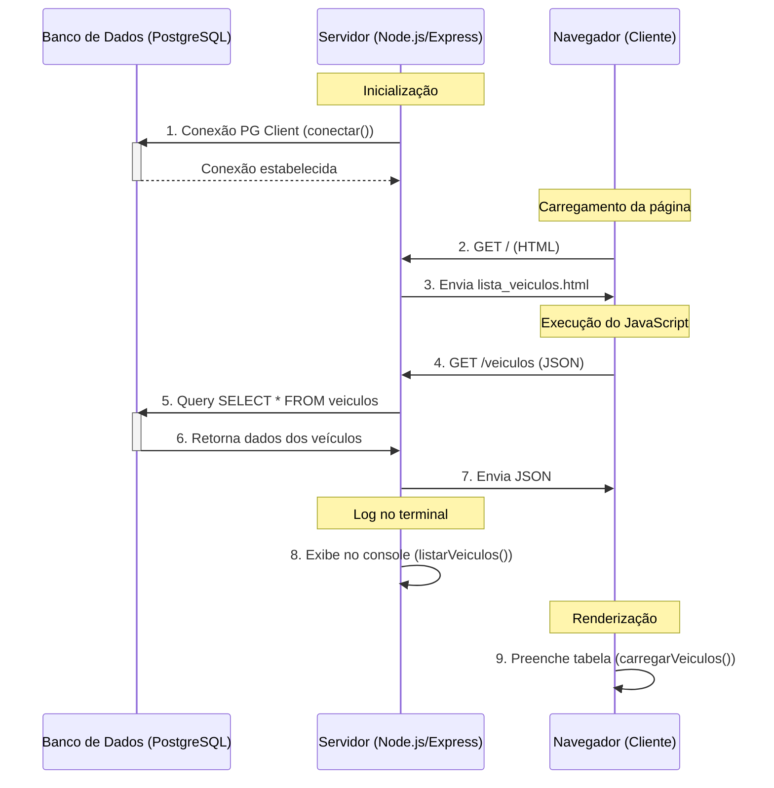
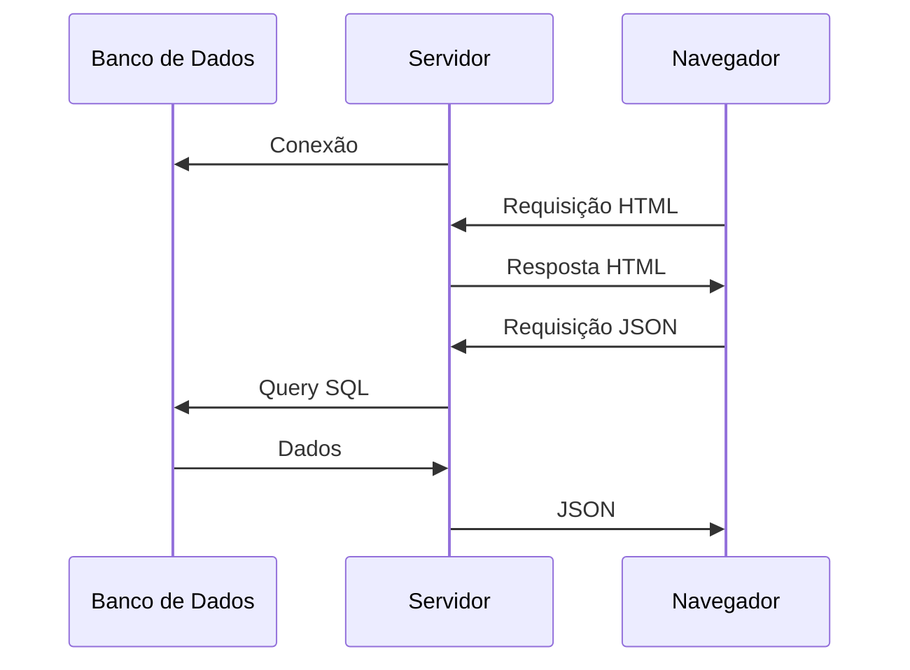
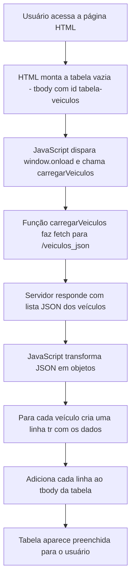

# node_db
Teste conexão Node_PostgreSQL

# Diagrama de Fluxo - Sistema de Veículos

Este diagrama mostra a comunicação entre os componentes do sistema:

# Passo a passo do Consumo de API no Front-end

